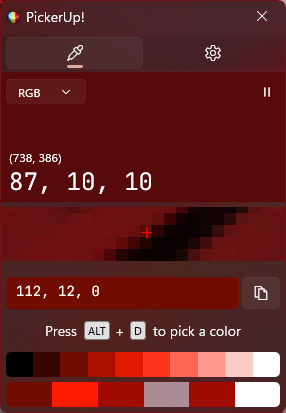
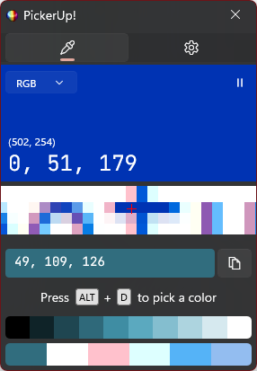

# PickerUp!

PickerUp! is a practical and intuitive tool designed to help you select and manage colors directly from your screen. It
offers powerful yet simple functionalities, making it ideal for designers, developers, and anyone working with colors.

---

## **Main Features**

### 1. Color Picker

PickerUp! allows you to select any color visible on your screen:

- **How to use:**
    - Press `ALT + D` to activate the color picker.
    - Move the cursor over any area of your screen to capture the desired color.
    - Once selected, the color code will be displayed in the selected format (default: hexadecimal).
- **Color formats:** You can copy the color code in various formats (HEX, RGB, HSL, etc.) via a dropdown menu.

---

### 2. Color Preview

After selecting a color, PickerUp! displays a preview so you can visually confirm the captured color:

- The preview box will appear in the interface.
- This helps ensure you've picked the exact shade you need.

---

### 3. Copy to Clipboard

Once a color has been selected, you can easily copy its code:

- Simply click the clipboard button next to the color code.
- The code will be copied to your clipboard, ready to be pasted wherever you need (design tools, code editors,
  documentation, and more).

---

### 4. Customizable Color Formats

PickerUp! supports multiple color code formats to cater to your requirements:

- **Available Formats:**
    - Hexadecimal (`#RRGGBB`)
    - RGB (`rgb(255, 0, 0)`)
    - HSL (`hsl(0, 100%, 50%)`)
- Use the dropdown menu in the interface to switch to your preferred format.

---

### 5. Color History

The app saves a history of previously selected colors for easy reference:

- Selected colors are displayed as blocks at the bottom of the interface.
- Clicking a color in the history will automatically copy its code to your clipboard.
- This is especially useful for managing multiple colors in a project.

---

### 6. Keyboard Shortcuts

- **`ALT + D`:** Quickly activate the color picker to capture a color.

This shortcut allows you to access the app's primary functionality without interrupting your workflow.

---

## Example Use Cases

- A designer selects colors from a palette in their browser and copies their codes to use in tools like Figma.
- A developer captures color codes from a UI to apply them in CSS or other styling configurations.
- A casual user captures a specific color from an image or webpage for personal purposes.

---

## Technical Support

If you need help or have questions about the application:

- **Project Repository on GitHub:** [GitHub - PickerUp!](https://github.com/dangos-dev/PickerUp)

---

Explore the world of colors with PickerUp! and make your workflow better than ever!